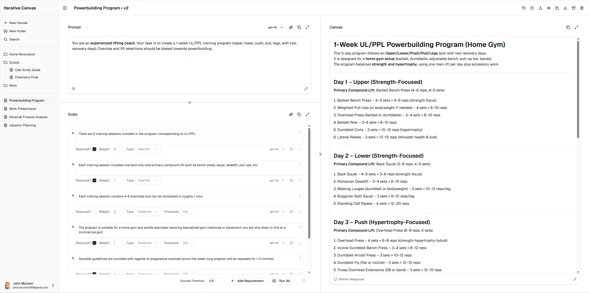

# Iterative Canvas

An iterative workspace for developing complex LLM prompts and validating their outputs against explicit, structured requirements. Instead of chatting with a model, users refine a single prompt–response artifact, use LLM-powered evaluations to automatically judge whether the output meets each requirement, and iterate until the response reliably satisfies all constraints. In some sense, it's a refinement of the LLM-as-judge pattern. More like... LLM**s**-as-judge.

Currently a work-in-progress.

---

